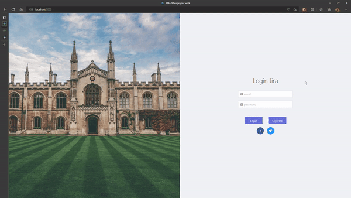
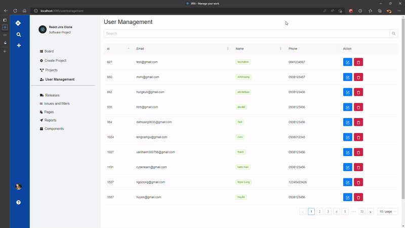
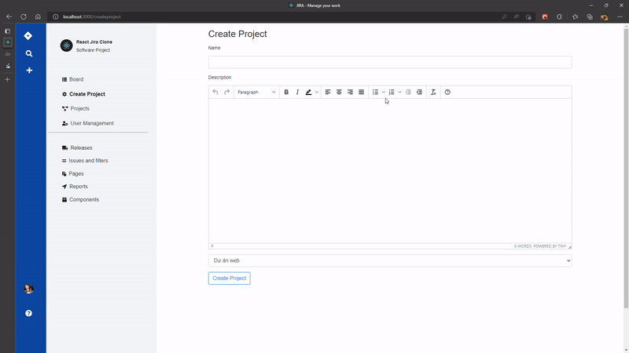
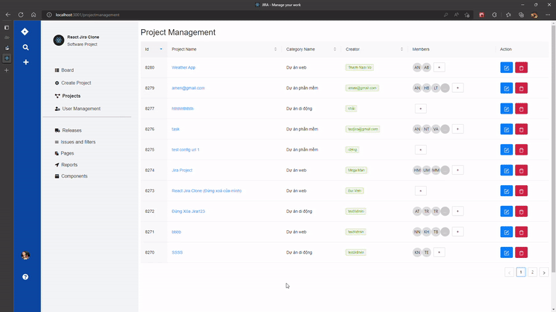

<h1>A Jira Clone build with ReactJS.</h1>
<h4>Technologies: React Functional component, React-Hook, Redux, Redux Saga, Fomik, Yup, React Router DOM, Ant Design, Axios</h4>
<h4>Source: https://github.com/vtnam2705/bc29_jira_vothanhnam</h4>

<h2>Jira is an application for managing users and projects. You can create projects, tasks and manage it easily</h2>

<h3>Here you can register an account and log in to the system</h3>

<h3>All information including email, phone number, username will be managed here. You can search, sort, edit or delete users</h3>

<h3>You can create, edit, delete projects and add members to each project</h3>

<h3>Each project you can create multiple tasks and can change task status, add members to each task.
Comment function will help to discuss among members easily.</h3>

<h2>Setting up development environment 🛠</h2>

<ul>
<li><h4>git clone https://github.com/vtnam2705/bc29_jira_vothanhnam.git</h4></li>
<li><h4>cd bc29_jira_vothanhnam</h4></li>
<li><h4>npm install (or yarn install)</h4></li>
<li><h4>npm start (or yarn start)</h4></li>
    
</ul>

